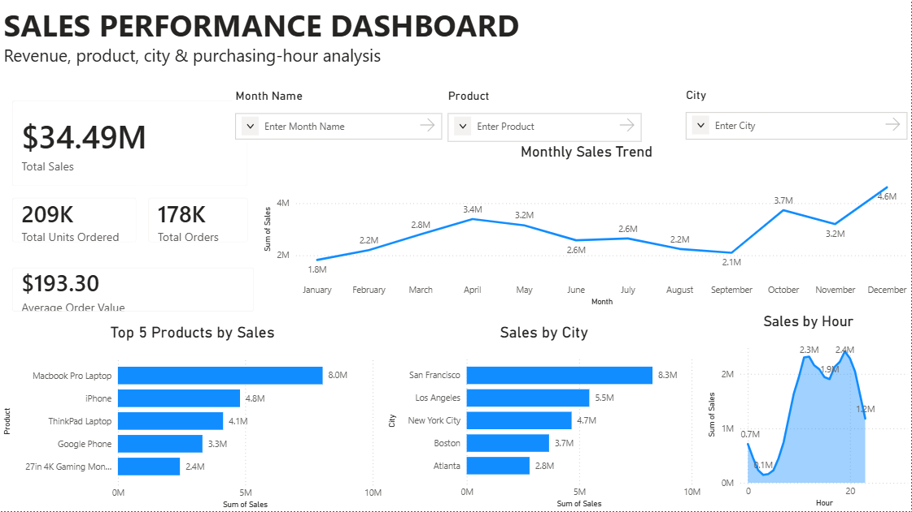
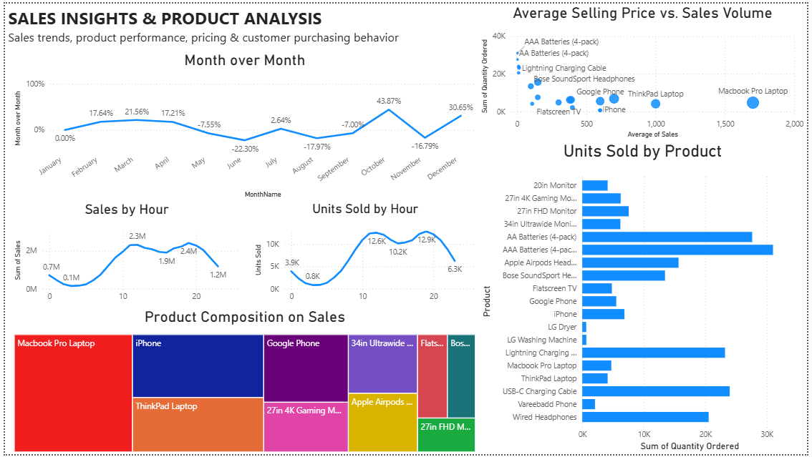

# Sales Performance Dashboard | Power BI

An interactive Power BI dashboard built to analyze sales performance,
product trends, pricing, and purchasing behavior.

## Dashboard Preview

## Key Features

- Revenue, orders, units sold and average order value KPIs
- Monthly sales trend analysis
- Month-over-month growth analysis
- Top product performance
- City-level sales analysis
- Sales and units sold by purchasing hour
- Average selling price vs. sales volume analysis
- Product composition analysis
- Interactive slicers and drill-downs

## Tools & Technologies

- Power BI
- DAX
- Excel
- Data Visualization
- Power Query

## Dataset

Sales dataset sourced from Kaggle.

## Key Insights

- Identified monthly sales growth and decline patterns.
- Compared product pricing against sales volume.
- Analyzed purchasing behavior across different hours.
- Identified high-performing products by revenue and units sold.
- Compared city-level sales performance.

## Project Files

- `.pbix` — Power BI dashboard
- `screenshots/` — Dashboard previews
- `dataset/` — Source dataset
